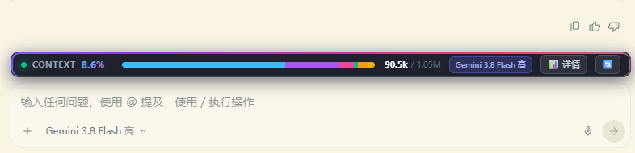

# ⚡ Antigravity 上下文流光长条组件 (Antigravity Context Meter Plugin)

> 专为 Google Antigravity 设计的高颜值、极客风「对话框顶部上下文流光容量条」独立插件包。  
> 遇到电脑重装系统、更新 Antigravity 或更换设备时，**双击一键即可秒级恢复安装**！



---

## 📸 功能特性

1. **对话框正上方长条对齐**：
   * 严格匹配主输入框（`agentSidePanelInputBox`）的宽度与左侧边距，像素级对齐。
   * 当在输入框中输入多行文字时，状态条自适应平滑上浮，始终维持 6px 间隙。
2. **多层极客动效流光 (Cyber Flowing Light)**：
   * **外框 360° 霓虹动态循环边框**（`agyBorderFlow`）。
   * **进度条全长激光流光掠影**（`agyShimmerSweep` 从左至右不断扫过）。
   * **呼吸状态指示灯**（绿色 <50%、琥珀 50%~80%、红色 >80% 呼吸光晕）。
3. **精准 6 大模块容量深度透视**：
   * 🛠️ **天蓝**：工具调用与终端命令输出
   * 🤖 **紫晶**：智能体回复与方案
   * 🧠 **粉红**：深度思考推理（Thinking）
   * 👤 **翠绿**：用户指令与提问
   * ⚙️ **琥珀**：系统预设与规则集
   * 📄 **明黄**：工件与关联 Markdown 文档
4. **跨项目/会话即时联动**：
   * 在侧边栏点击切换任意项目或对话，状态栏秒级同步切换为该项目的真实容量与 Token 数。
5. **智能避让与隐退**：
   * 输入 `@` 引用文件/智能体或 `/` 调用斜杠工具时，长条状态栏无感极速隐退，并将联想选择菜单提升至最顶层（`z-index: 99999`），彻底消除遮挡，所有候选项 100% 完整展示与点击；菜单关闭后瞬间平滑恢复。
   * 打开模型切换菜单时，菜单自然居于上层，完全不遮挡点击。
   * 点击左下角进入「设置」时，状态栏彻底自动隐去；返回对话后立即恢复。
6. **悬浮透视与一键锁定**：
   * 鼠标移入浮现半透明磨砂透视卡片，点击长条或「📊 详情」即可固定面板，支持一键旋转刷新与右上角快速关闭。

---

## 🚀 重装系统或新设备：如何一键添加？

当重装系统或在全新电脑上安装 Antigravity 后，只需两步：

### 第一步：运行一键安装
在当前插件目录下，**直接双击运行 `install.bat`**  
*(或在 PowerShell 中执行 `.\install.ps1`)*

脚本将全自动完成：
1. 自动探测 Antigravity 路径；
2. 自动安全备份原始文件（`preload.js.bak`）；
3. 部署核心统计与微服务组件；
4. 注入流光长条 UI 引擎；
5. 启动本地后台微服务并完成自检。

### 第二步：刷新界面生效
打开 Antigravity 窗口，按下快捷键：  
👉 **`Ctrl + R`（重新加载页面）**  
即可立刻看到炫酷的顶部流光长条！

---

## 🗑️ 如何一键卸载？

如果想要彻底移除长条恢复原始状态：
* **双击运行 `uninstall.bat`** 即可。
* 脚本会自动还原备份的原始文件，清理所有临时注入，不留任何痕迹。

---

## 📁 插件包目录结构

```text
antigravity-context-meter/
├── plugin.json               # 官方插件配置清单 (支持 Antigravity 插件识别)
├── README.md                 # 本说明文档
├── install.bat               # Windows 一键自动安装脚本 (双击即装)
├── install.ps1               # PowerShell 核心安装引擎
├── uninstall.bat             # 一键干净卸载恢复脚本 (双击即卸)
├── uninstall.ps1             # PowerShell 卸载还原引擎
├── core/
│   ├── contextBarEngine.js   # 渲染层顶部长条 UI 与流光样式引擎
│   ├── contextStats.js       # 上下文 Token 解析与精确统计核心
│   └── contextServer.js      # 极速本地微服务 (端口 49152)
└── skills/
    └── context-meter/
        └── SKILL.md          # 技能描述文件，供智能体自主识别与维护
```

---

## 💡 常见问题与技巧

* **Q: 为什么我按了 Ctrl+R 没看到长条？**  
  A: 检查 Antigravity 是否完全启动，并确认是否处于具体项目对话页面中（在空白启动页或设置页中会长条会自动隐藏）。
* **Q: 之后 Antigravity 更新了怎么办？**  
  A: 如果官方更新覆盖了核心文件，只需再次双击 `install.bat` 重新安装即可，1 秒完成！
